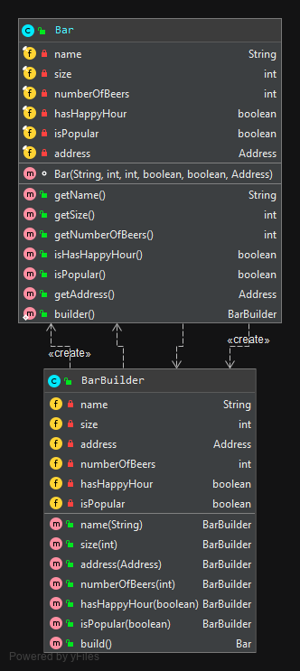

## Builder

### Description
>Builder pattern designed to deal with the construction of comparatively complex objects.
>Specially when it can be built with many parameters, in multiple combinations

### Example diagram


### Demonstration
#### The Bar object
```java
public class Bar {
    // Make fields final
    private final String name;
    private final int size;
    private final int numberOfBeers;
    private final boolean hasHappyHour;
    private final boolean isPopular;
    private final Address address;

    // Should not be public if you only want the builder to be accessible to define the object
    // In that cas, pass the builder as parameter
    Bar(String name, int size, int numberOfBeers, boolean hasHappyHour, boolean isPopular, Address address) {
        this.name = name;
        this.size = size;
        this.numberOfBeers = numberOfBeers;
        this.hasHappyHour = hasHappyHour;
        this.isPopular = isPopular;
        this.address = address;
    }

    public String getName() {
        return name;
    }
    public int getSize() {
        return size;
    }
    public int getNumberOfBeers() {
        return numberOfBeers;
    }
    public boolean isHasHappyHour() {
        return hasHappyHour;
    }
    public boolean isPopular() {
        return isPopular;
    }
    public Address getAddress() {
        return address;
    }

    // Allow to use directly "Bar.builder()" instead of "new BarBuilder().builder()"
    public static BarBuilder builder() {
        return new BarBuilder();
    }
}
```

#### The Bar Builder
```java
public class BarBuilder {
    
    private String name;
    private int size;
    private Address address;
    private int numberOfBeers;
    private boolean hasHappyHour;
    private boolean isPopular;

    public BarBuilder name(String name) {
        this.name = name;
        return this;
    }

    public BarBuilder size(int size) {
        this.size = size;
        return this;
    }

    public BarBuilder address(Address address) {
        this.address = address;
        return this;
    }

    public BarBuilder numberOfBeers(int numberOfBeers) {
        this.numberOfBeers = numberOfBeers;
        return this;
    }

    public BarBuilder hasHappyHour(boolean hasHappyHour) {
        this.hasHappyHour = hasHappyHour;
        return this;
    }

    public BarBuilder isPopular(boolean isPopular) {
        this.isPopular = isPopular;
        return this;
    }

    public Bar build() {
        return new Bar(name, size, numberOfBeers, hasHappyHour, isPopular, address);
    }
}
```

#### Utilization
```java
class BarBuilderTest {

    @Test
    void should_build_bar() {
        // given
        String name = "Still";
        String country = "France";
        int numberOfBeers = 15;
        Address address = Address.builder()
                .country(country)
                .build();
        Bar bar = new Bar(name, 100, numberOfBeers, true, true, address);

        // when
        Bar bar2 = Bar.builder()
                .name(name)
                .numberOfBeers(numberOfBeers)
                .isPopular(true)
                .address(address)
                .build();

        // then
        assertThat(bar2.getName()).isEqualTo(bar.getName());
        assertThat(bar2.getAddress().getCountry()).isEqualTo(bar.getAddress().getCountry());
    }
}
```

### Using Lombok
- Lombok `@Builder`: [here](https://projectlombok.org/features/Builder)
- Lombok `@Accessors`: [here](https://projectlombok.org/features/experimental/Accessors)

### Bad alternative : the Telescoping Constructor Pattern
```
Bar(String name) { //...}
Bar(String name, int size) { //...}
Bar(String name, int size, int numberOfBeers) { //...}
// ...
Bar(String name, int size, int numberOfBeers, boolean hasHappyHour, boolean isPopular, Address address) { //...}
```
The problem with this pattern is that once constructors are 4 or 5 parameters long it becomes difficult to remember 
the **required order of the parameters** as well as **what particular constructor you might want in a given situation**.

### Another bad alternative : the JavaBean Pattern
```
Bar bar = new Bar(String name);
bar.setSize(5);
bar.setNumberOfBeers(15);
// ...
```
The problem with this pattern is that is because the object is created over several calls it may be in an 
**inconsistent state** partway through its construction.
Moreover it may be very annoying to call all the setters