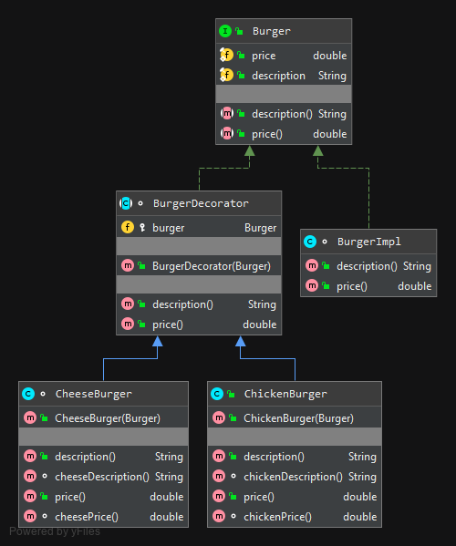

## Decorator

### Description
The Decorator pattern allows behavior to be added to an individual object, either statically or dynamically, 
without affecting the behavior of other objects from the same class. It can be considered as an alternative to subclassing. 
We know that subclassing adds behavior at **compile time** and the change affects all instances of the original class. 
On the other hand, decorating can provide new behavior at **runtime** for selective objects.

### Demonstration
TODO

### Example diagram

### Difference with Subclassing (Inheritance)
Suppose you have a `Burger` class. Then in some place you want to add **cheese**, so you may subclass `Burger` and 
create `CheeseBurger` class. And in some other place you want to add **chicken**. So you subclass again and create 
`ChickenBurger` class. Well, now in some place you want **cheese and chicken**. None of the previous two sub classes 
have both capability. So you need to create a third one. When creating a `ChickenCheeseBurger` you are actually duplicating 
the effort. You don't need this class if you have any way to compose the capability of previous two. Well, things can go worse 
and these may lead to unnecessary class explosion.