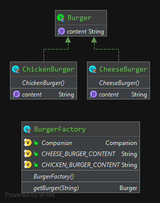

## Factory method

### Description
> Factory method pattern defines an interface for creating an object, but let subclasses decide which class to instantiate.
> The Factory method lets a class defer instantiation to subclasses.

### Example diagram


### Demonstration
#### The Burger Interface
```kotlin
interface Burger {
    val content: String
}
```

#### The Burger classes
```kotlin
class CheeseBurger : Burger {
    override val content: String
        get() = "cheese"
}

class ChickenBurger : Burger {
    override val content: String
        get() = "chicken"
}
```

#### The Burger Factory
```kotlin
internal class BurgerFactory {

    companion object {
        const val CHEESE_BURGER_CONTENT = "cheese"
        const val CHICKEN_BURGER_CONTENT = "chicken"
    }

    fun getBurger(desiredContent: String): Burger {
        return when(desiredContent) {
            CHEESE_BURGER_CONTENT -> CheeseBurger()
            CHICKEN_BURGER_CONTENT -> ChickenBurger()
            else -> throw IllegalArgumentException("Unknown content")
        }
    }
}
```

#### Utilization
```kotlin
internal class BurgerFactoryTest {

    private var burgerFactory: BurgerFactory? = null

    @BeforeEach
    fun setUp() {
        burgerFactory = BurgerFactory()
    }

    @Test
    fun `calling factory with cheese content should return cheese burger`() {
        // when
        val burger = burgerFactory!!.getBurger(BurgerFactory.CHEESE_BURGER_CONTENT)

        // then
        assert(burger is CheeseBurger)
    }

    @Test
    fun `calling factory with chicken content should return chicken burger`() {
        // when
        val burger = burgerFactory!!.getBurger(BurgerFactory.CHICKEN_BURGER_CONTENT)

        // then
        assert(burger is ChickenBurger)
    }

    @Test
    fun `calling factory with other content should throw illegal argument exception`() {
        // when then
        assertFailsWith<IllegalArgumentException> { burgerFactory!!.getBurger("fish") }
    }
}
```